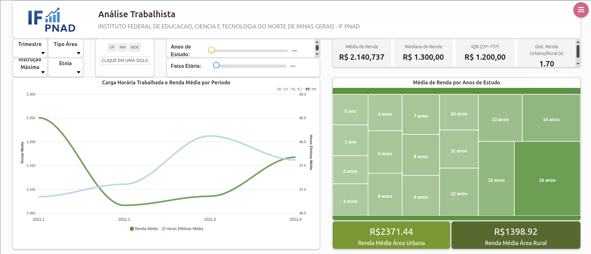
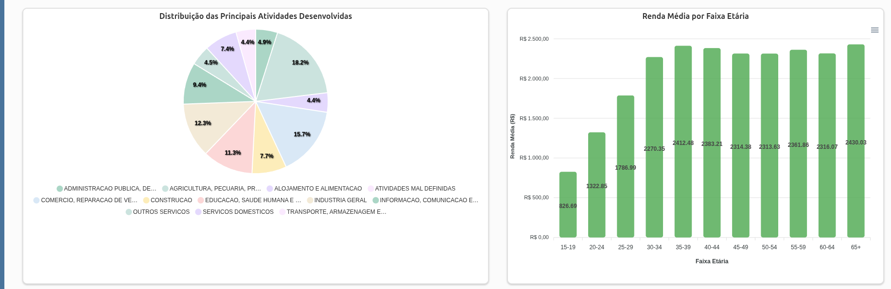
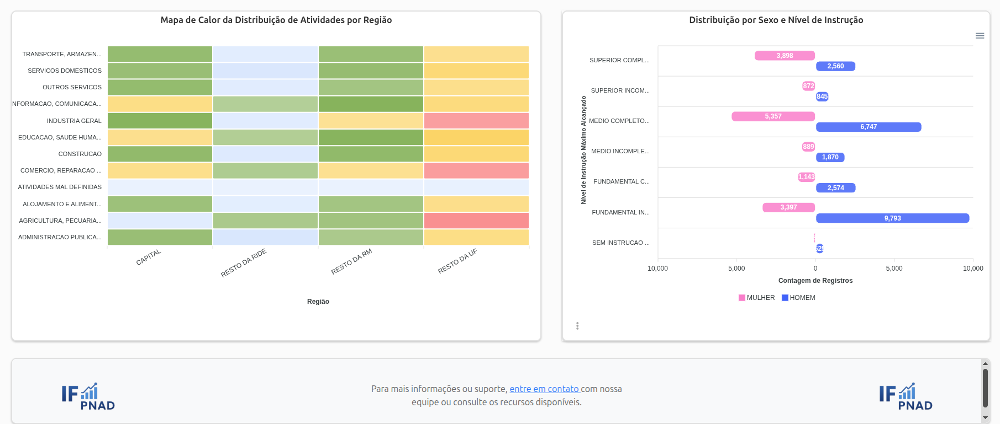

# Pipeline ETL PNAD - Extração e Visualização

## Visão Geral

Este projeto demonstra a implementação de um **pipeline ETL completo** para processamento de dados da **PNAD (Pesquisa Nacional por Amostra de Domicílios)** do IBGE, utilizando tecnologias modernas de engenharia de dados. A iniciativa foi desenvolvida como parte de um teste prático para atuação no projeto 'Cajui Analytics'(software de análise de dados do IFNMG) e aprovado em **primeiro lugar**, demonstrando competências avançadas em:

- **Engenharia de Dados**: Pipeline ETL robusto e escalável
- **Modelagem Dimensional**: Design de data warehouse otimizado
- **Web Scraping**: Automação de coleta de dados
- **Business Intelligence**: Visualizações interativas e dashboards
- **Arquitetura de Software**: Código limpo, modular e bem documentado

## 🎯 Objetivos Alcançados

### Implementações Completas
- **Pipeline ETL End-to-End**: Extração, transformação e carregamento automatizado
- **Modelagem Dimensional**: 5 dimensões + 1 fato com relacionamentos otimizados
- **Web Scraping Inteligente**: Coleta automática de dados e dicionários do IBGE
- **Tratamento de Dados**: Normalização, limpeza e validação robusta
- **Cache Inteligente**: Otimização de performance com cache de dimensões
- **Arquitetura Modular**: Código organizado e reutilizável

### 🎨 Dashboards e Visualizações
- **Knowage BI**: Plataforma de Business Intelligence integrada
- **Gráficos Interativos**: Visualizações HTML/CSS/JavaScript customizadas
- **Análises Multidimensionais**: Insights sobre trabalho, educação e demografia

> **Nota**: Devido às limitações da ferramenta Knowage BI para exportação de cockpits, todos os gráficos foram implementados como custom charts(HTML, CSS, JavaScript) e estão disponíveis em [Dashboard](dashboard/).

## 🏗️ Arquitetura do Sistema

### Estrutura do Projeto
```
projeto/
├── src/
│   ├── pipeline/
│   │   ├── mapper.py           # Mapeamento inteligente de colunas
│   │   ├── webScrapping.py     # Coleta automatizada de dados
│   │   ├── extract.py          # Extração otimizada de dados
│   │   ├── etl.py             # Pipeline ETL principal
│   │   └── transform/         # Módulos de transformação
│   │       ├── tratar_campos_texto.py
│   │       ├── tratar_educacao.py
│   │       └── tratar_fato_trabalho_pessoa.py
│   ├── util/
│   │   ├── data_pattern.py    # Utilitários de tratamento de texto
│   │   └── orm_utils.py       # Utilitários ORM
│   ├── connection.py          # Configuração de conexão
│   └── dimensional_models.py  # Modelos dimensionais SQLAlchemy
├── data/                     # Dados que seão processados e dump
│   └── dump/
│       └── dump.backup       # dados processados
├── dashboard/              # Código dos gráficos interativos
│   ├── graficoLinhas/
│   │   ├── GL_css.css
│   │   └── GL_html.html
│   │   └── GL_javascript.js
│   ├── slices/
│   └── ...
├── README.md
├── Dicionario_dados.md     # dicionario das variaveis e as descrições das variaveis
├── ERD.png                 # diagrama de entidade relacionamento
└── requirements.txt        # Dependências do projeto
```

## 📊 Modelagem Dimensional

### Modelos Dimensionais
- **Educacao**: Dimensão de educação (tipo_escola_desc, nivel_instrucao_max_desc, anos_estudo, frequenta_escola_desc, sabe_ler_escrever_desc)
- **Regiao**: Dimensão geográfica (nome_uf_desc, area_desc, situacao_domicilio_desc)
- **Individuo**: Dimensão de características individuais (sexo_desc, idade, cor_raca_desc, nmr_pessoas_domicilio)
- **Tempo**: Dimensão temporal (ano, trimestre)
- **Trabalho**: Dimensão de trabalho (condicao_ocupacao_desc, posicao_ocupacao_trabalho_principal_desc, atividade_principal_desc)
- **Fato_Trabalho_pessoa**: Tabela de fatos relacionando todas as dimensões

### Pipeline ETL - Técnico

O processo de ETL começa no arquivo etl.py, que é o arquivo principal do projeto. Nele é definido o ano que será processado e aplicado o web scraping(webScrapping.py) para obter o dicionario das variaveis e os microdados da PNAD(os dados são salvos no diretorio data), é realizada uma junção automatica das colunas do dicionario com as colunas do microdados para obter a descrição correta das variaveis, o arquivo mapper.py é responsável por mapear as colunas do dicionario com as colunas do microdados. Após isso, o arquivo extract.py é responsável por ler os dados do arquivo sas e transforma-los em um DataFrame. O diretório transform/ contem os scripts que tratam os dados e retornam o DataFrame tratado. Por fim, o controle retorna ao arquivo etl.py que é responsável por carregar os dados no banco de dados de acordo com o modelo definido no arquivo dimensional_models.py via ORM com SQLAlchemy.

## Funcionalidades Adicionais

- ✅ Coleta automática de microdados trimestrais
- ✅ Download e descompactação de arquivos ZIP
- ✅ Mapeamento inteligente de dicionários
- ✅ Tratamento de erros robusto(Normalização de texto, remoção de acentos, uppercase,etc)

## 📊 Gráficos e Visualizações

### 🎨 Dashboard Implementado





### 📈 Análises Disponíveis

1. **Distribuição Demográfica**
   - Perfil por idade, gênero e região
   - Análise de cor/raça por estado

2. **Indicadores Educacionais**
   - Nível de instrução por região
   - Anos de estudo por faixa etária
   - Frequência escolar

3. **Métricas de Trabalho**
   - Renda média por ocupação
   - Horas trabalhadas por setor
   - Distribuição por posição na ocupação

4. **Análises Multidimensionais**
   - Correlação entre educação e renda
   - Diferenças regionais no mercado de trabalho
   - Evolução temporal dos indicadores

### 🎬 Demonstração em Vídeo

**Link para demonstração completa do dashboard:** https://youtu.be/_xLaru0XOsI

> **[ESPAÇO RESERVADO PARA GIFS DOS GRÁFICOS EM AÇÃO]**
> 
> *Aqui serão inseridos GIFs mostrando a interatividade dos dashboards*

## 🛠️ Tecnologias Utilizadas

### Backend
- **Python 3.12.3**: Linguagem principal
- **SQLAlchemy**: ORM para modelagem dimensional
- **Pandas**: Manipulação e transformação de dados
- **Requests**: Web scraping e APIs

### Frontend (Dashboards)
- **HTML5/CSS3**: Estrutura e estilização
- **JavaScript**: Interatividade e animações
- **Knowage BI**: Plataforma de Business Intelligence

### Banco de Dados
- **PostgreSQL**: Banco de dados relacional
- **Modelagem Dimensional**: Star Schema 

## 🚀 Instalação e Configuração

### Pré-requisitos
- Python 3.12.3+
- PostgreSQL

### 1. Clone e Configure
```bash
git clone <repository-url>
cd projeto
python -m venv venv
source venv/bin/activate  # Linux/Mac
# ou
venv\Scripts\activate     # Windows
```

### 2. Instale Dependências
```bash
pip install -r requirements.txt
```

### 3. Configure o Banco de Dados
```bash
# Crie o arquivo .env baseado no .envexample
cp .envexample .env

# Configure as credenciais no .env
# Crie o banco de dados com esquema 'dimensional'
```

### 4. Execute o Pipeline
```bash
python .
```

## 📈 Otimizações

### Otimizações Implementadas
- ✅ **Cache Inteligente**: Evita reprocessamento de dimensões
- ✅ **Processamento em Lotes**: Reduz uso de memória
- ✅ **Índices Otimizados**: Consultas rápidas no banco
- ✅ **Transações Eficientes**: Commit em lotes

## 🎯 Diferenciais do Projeto

### 1. **Automação Completa**
- Web scraping automatizado do IBGE
- Mapeamento inteligente de dicionários
- Pipeline end-to-end sem intervenção manual

### 2. **Arquitetura Escalável**
- Código modular e reutilizável
- Separação clara de responsabilidades
- Fácil manutenção e extensão

### 3. **Qualidade de Dados**
- Validação robusta em todas as etapas
- Tratamento inteligente de valores nulos
- Normalização consistente de dados

### 4. **Performance Otimizada**
- Cache de dimensões
- Processamento em lotes
- Consultas otimizadas

## 📚 Documentação Adicional

- **Dicionário de Dados**: `Dicionario_dados.md`
- **Diagrama ER**: `ERD.png`
- **Demonstração**: [Vídeo no YouTube](https://youtu.be/_xLaru0XOsI)

## 🏆 Conclusão

Este projeto representou um grande desafio, não apenas relacioando a competências técnicas, mas também a capacidade de entregar soluções completas e funcionais dentro de prazos curtos. Além da aprovação o teste prático serviu como uma importante validação das minhas habilidades em engenharia de dados, a partir deste teste puder perceber que qualidade técnica e capacidade de entrega são igualmente importantes e é necessario realizar um planejamento para que ambas sejam compridas com êxito. Mesmo com limitações de tempo, desde o começo decidi fazer um gerenciamento das principais atividades que deveriam ser entregues e direcionar meus esforços nas informações mais importantes, isso me permitiu desenvolver uma solução que permite visualizar, analisar e explorar os dados da PNAD Contínua de forma clara, flexível e acessível, facilitando a geração de insights relevantes para a tomada de decisão.

## 🤝 Contribuições e Melhorias Futuras

- [ ] Suporte a múltiplos anos de dados
- [ ] Machine Learning para predições
- [ ] Mais visualizações interativas
- [ ] Integração com outras fontes de dados

## 📞 Contato

Para dúvidas sobre o projeto ou oportunidades de colaboração:

- **LinkedIn**: [https://www.linkedin.com/in/filipeabner18/]
- **Email**: [filipeabner18@gmail.com]
- **GitHub**: [https://github.com/FilipeAbner]

